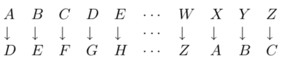

# Cadeias de caracteres

Em Python, as cadeias de caracteres correspondem a um tipo estruturado de informação, designado por str, o qual corresponde a uma sequência de caracteres individuais. As cadeias de caracteres são definidas através da seguinte expressão em notação BNF:

```sql
<cadeia de caracteres> ::= ’caracter'∗    |
                          ""caracter∗ ""  |                        
                          """caracter∗ """
```

A definição indica que uma cadeia de caracteres é uma sequência de zero ou mais caracteres delimitados por plicas `'`, por aspas `"` ou por três aspas `"""`.


As cadeias de caracteres `''` e `""` são chamadas cadeias de caracteres vazias.



As cadeias de caracteres delimitadas por três aspas, chamadas cadeias de caracteres de documentação, sao usadas para documentar definições.



As cadeias de caracteres delimitadas por três aspas, chamadas cadeias de caracteres de documentação, sao usadas para documentar definições.


```sql
def soma_elementos (t):
    """
    Recebe um tuplo e devolve a soma dos seus elementos
    """
    soma = 0
    for e in t:
        soma = soma + e
    return soma
    
    >>> help(soma_elementos)
Help on function soma_elementos in module __main__:

soma_elementos(t)
    Recebe um tuplo e devolve a soma dos seus elementos

```


Tal como os tuplos, as cadeias de caracteres sao tipos imutáveis, no sentido de que não podemos alterar os seus elementos.


Os elementos das cadeias de caracteres sao referenciados utilizando um índice, de um modo semelhante ao que é feito em relação aos tuplos.

```sql
>>> fp='Programacao I'

>>> fp[0]
'P'
>>> fp[12:]
'I'
>>> fp[:11]
'Programacao'
>>> fp[-3:]
'cao'
>>>
```

Existem várias operações pré-definidas que podemos aplicar sobre cadeias de caracteres, estas são aprsentadas nos exemplos que se seguem.


| Operador | Tipo dos argumentos | Descrição |
| :--- | :--- | :--- |
|  a + b | Cadeias de caracteres | A concatenação das cadeias de caracteres |
|  s \* i | Cadeia de caracteres e inteiro | A repetição i vezes da cadeia de caracteres s. |
| s\[i1 :i2 \] | Cadeia de caracteres e inteiros | A sub-cadeia de caracteres de s entre os índices i1 e i2 − 1. |
| e in s | Cadeias de caracteres | True se o elemento e pertence à cadeia de caracteres s; False em caso contrario. |
| len\(s\) | Cadeia de caracteres | O nu ́mero de elementos da cadeia de caracteres s. |

A seguinte interacção mostra a utilização destas operações:

```sql
>>> cumprimento = ’bom dia!’
>>> cumprimento[0:3]
’bom’

>>> ’ola ’ + cumprimento
’ola bom dia!’

>>> cumprimento * 3
’bom dia!bom dia!bom dia!’

>>> ’z’ in cumprimento
False

>>> ’ab’ in ’abcd’
True

>>> len(cumprimento)
8
```

a seguinte função recebe duas cadeias de caracteres e devolve os caracteres da primeira cadeia que também existem na segunda:

```sql
def simbolos_comum (s1, s2):
 s_comum = ’’
 for s in s1:
    if s in s2:
        s_comum = s_comum + s
 return s_comum
 
 
 f1 = ’Fundamentos da programa ̧c~ao’ 
 f2 = ’ ́Algebra linear’ 
 
 simbolos_comum(f1, f2)
’naen a rgraa’

```


| Sintaxe | Descrição |
| :--- | :--- |
| s.capitalize\(\) | Retorna uma nova string com a primeira letra em maiusculo. |
| s.center\(width, char\) | Retorna uma nova string no tamanho width centralizada com espaços ou char preenchendo ambos o lados. |
| s.ljust\(width, char\) | Retorna uma nova string no tamanho width alinhada a esquerda e com espaços ou char preenchendo o restante à direita. |
| s.rjust | Retorna uma nova string no tamanho width alinhada a direita e com espaços ou char preenchendo o restante à esquerda. |
| s.count\(t, end\) | Retorna o número de ocorrências de t em s ou na fatia de s finalizado em end. |
| s.find\(t, start, end\) | Retorna a posição de t mais a esquerda em s ou na fatia começando por start e terminado em end. Se nada for encontrado retorna -1. |
| s.rfind\(t, start, end\) | O mesmo que find\(\) porém buscando a partir da direita. |
| s.isalnum\(\) | Retorna True se s não for vazia e cada caractere de s é alfanumérico. |
| s.isalpha\(\) | Retorna True se s não for vazia e cada caractere de s é uma letra. |
| s.isdecimal\(\) | Retorna True se s não for vazia e cada caractere de s é um numérico Unicode. |
| s.isdigit\(\) | Retorna True se s não for vazia e cada caractere de s é é um numérico ASCII. |
| s.isidentifier\(\) | Retorna True se s não for vazia e um identificador valido. |
| s.islower\(\) | Retorna True se s não for vazia e todos os caracteres estão em minusculas. |
| s.isuper\(\) | Retorna True se s não for vazia e todos os caracteres estão em maiúscula. |
| s.isspace\(\) | Retorna True se s não for vazia e todos os caracteres são espaços. |
| s.join\(t\) | Fatia t é insere s entre cada pedaço de t, exemplo: s = ‘.’ t=’dois’ s.join\(t\)=’d.o.i.s’ |
| s.lower\(\) | Retorna uma nova string toda em minusculas. |
| s.upper\(\) | Retorna uma nova string toda em maiúsculas. |
| s.partition\(t\) | Retorna uma tupla de três strings a parte de s antes de t, t e e a parte de s depois de t. |
| s.split\(t, n\) | Retorna uma lista de strings fragmentas pela string t no máximo n vezes. Se n não for dado fragmenta tudo. Se t não for dado fragmenta pelos espaços em branco. |
| s.splitlines\(f\) | Retorna um lista de strings fragmentadas no finalizador de linhas e sem os finalizadores ou com eles caso f seja True. |
| s.strip\(t\) | Retorna uma nova string retirando os caracteres de espaço a direita e a esquerda ou se for dado os caracteres em t. |
| s.lstrip\(chars\) | Retorna uma nova string retirando os caracteres de espaço a a esquerda ou se for dado os caracteres em chars. |
| s.rstrip\(chars\) | Retorna uma nova string retirando os caracteres de espaço a a direita ou se for dado os caracteres em chars. |
| s.swapcase\(\) | Retorna uma nova string trocando maiúsculas por minusculas e vice versa. |
| s.title\(\) | Retorna uma nova string com a primeira letra de cada palavra em maiúscula. |
| s.zfill\(n\) | Retorna uma nova string em que se s for menor que n o que estiver a esquerda e substituído por zeros. |

## 



Escreva uma função  primeira\(c,txt\) que procure se um caracter c ocorre em na cadeia txt. Em caso afirmativo, retorne o índice da primeira ocorrência, em caso negativo, retorne -1.



```sql
def primeira(c, txt):
"Índice da 1a ocorrência de c em txt." i=0
while i < len(txt):
    if txt[i] == c: # encontrou
        return i # retorna o índice
    i = i + 1 # próximo índice
```



```sql
def ultima(c, txt):
    "Índice da última ocorrência de c em txt."
    i = len(txt)-1
    while i >= 0:
        if txt[i] == c: # encontrou
            return i # retorna o índice
        i = i - 1 # próximo índice return -1 # não encontrou: retorna -1
```



## Exercícios práticos

1. Escreva uma função que recebe uma string e converte letras maiúsculas para minúsculas.
2. Dada uma string representando uma cadeia de DNA, faça um programa que imprima a quan;dade de bases desta cadeia; Inverta a string; Caso a sequência CTAG acontecer imprima a posição inicial da sequência. Atribua a sequência de caracteres da cadeia começando por C até o final da string para uma outra string.
3. Escreva uma  função que recebe uma string e devolve uma outra string com as letras minúsculas convertidas para maiúsculas;
4. Escreva um programa que solicite ao utilizador nomes de pessoas e os apresente no ecrã até que seja introduzido o nome “FIM”.
5. Implemente a função strcountd\(s\) que devolve o número de dígitos na string s. Por exemplo, strcountd\(“boavista 0 sporting 3”\)  devolve 2. Utilize a função isdigit\(c\) que devolve verdadeiro se o caractere c for um dígito;
6. Implemente a função ultind\(s, c\) que devolve o último índice em que encontrou o caractere c em s. Caso não exista devolve –1;
7. Implemente a função strcap\(s\) que verifica se a string s é capicua, isto é, se é lida da mesma forma da esquerda para a direita e da direita para a esquerda. Devolve verdadeiro se for capicua.
8. Implemente a função indchr\(s, ch\) que devolve o índice em que ocorre a primeira ocorrência do caractere ch na string s. Se o caractere não existir devolve –1.
9. Escreva um programa que leia nomes e os apresente no ecrã até que um nome vazio seja introduzido pelo utilizador.
10. Escreva uma função que recebe uma string como argumento e verifica se a string é um palíndromo ou não. Uma palavra é um palíndromo se se ler da mesma maneira da esquerda para a direita e vice-versa.
11. Escreva uma função que recebe dois argumentos, uma string e um inteiro. O valor do inteiro tem que ser menor que o número de caracteres da string. A função remove todas as ocorrências do caracter da string que estejam em posições que são múltiplas do valor inteiro passado como argumento.
12. Escreva uma função que concatena duas strings. A função recebe 2 argumentos, a string destino e a string fonte. A função adiciona ao fim da string destino o conteúdo da string fonte. Assuma que a string destino tem espaço suficiente para guardar a 2 string. A função retorna o tamanho da string destino, após a concatenação
13. Escreva uma função que recebe uma  string que contem um número interio e devolva o correspondente número inteiro
14. Escreva uma função num\_caracteres\(txt\) que retorna o número de carateres da string txt. Exemplo: num\_digs\("asde"\) -&gt; 4
15. Implemente a função  Max\_Ascii\(str\) que devolve o caractere com maior código ASCII presente na string str.
16. Implemente a função  _UpDown\(_ s\) que coloca os caracteres da string s alternadamente em maiúsculas e minúsculas.
17. Implemente a função  _strlwr\(_ str\) que coloca todos os caracteres de str em minúsculas, devolvendo a nova string. Utilize a função tolower\( c\) que devolve c minúsculo.
18. Implemente a função _strrev\(_s\) que inverte a string s e devolve-a invertida.
19. Considera-se para este problema que uma string  s   representa um valor inteiro ou decimal, se for constituída por uma sequência de 1 ou mais dígitos ou por uma sequência de 1 ou mais dígitos, seguida de  ́. ́, seguida de uma sequência de 0 ou mais dígitos. Escreva uma função  numero\(s\)   que retorna  True   se  s  representa um valor inteiro ou decimal e  False   caso contrário. Exemplo: numero\("123"\) -&gt; True, numero\(".123"\) -&gt; False;
20. Implemente a função  _xspace\(_ s\) que coloca um espaço depois de cada caractere que não seja um espaço na string s.
21. Implemente a função  _wordupr\(_ s\) que recebe uma string, coloca a primeira letra de cada palavra em maiúscula e as restantes em minúsculas.
22. Escreva um programa que leia nomes completos do teclado e os escreva no formato Apelido, Nome. Por exemplo se for introduzido Antonio FILIPE Marques deverá escrever Marques, Antonio Filipe. Deverá colocar apenas a primeira letra de cada nome em maiúsculas. Deverá terminar o programa quando o utilizador escrever FIM em minúsculas ou maiúsculas.
23. As seguintes funções pretendem verificar se uma string contém alguma letra minúscula, mas algumas delas estão erradas. Para cada função, descreva o que ela faz \(assumindo que o parâmetro seja uma string\).

```sql
def any_lowercase1(s):
    for c in s:
        if c.islower():
            return True
        else:
            return False

def any_lowercase2(s):
    for c in s:
        if 'c'.islower():
            return 'True'
        else:
            return 'False'

def any_lowercase3(s):
    for c in s:
        flag = c.islower()
    return flag

def any_lowercase4(s):
    flag = False
    for c in s:
        flag = flag or c.islower()
    return flag

def any_lowercase5(s):
    for c in s:
        if not c.islower():
            return False
    return True
```

## Exercícios laboratoriais

1. Escreva uma função `ocorrencias(txt,c)` que retorna uma lista com os índices das ocorrências do caracter `c` na  string  `txt`. Por exemplo:  `ocorrencias("banana", "a")` . devolve \[1, 3, 5\]
2. Escreva um função chamada `contaCar(txt,c)` que  conta o número de ocorrências do caracter `c` numa string  `txt.`
3. Implemente a função strcountc\(s, ch\) que devolve o número de ocorrências do caractere ch na string s.
4. Implemente a função strlen\(s\) que devolve o número de caracteres existentes na string s;
5. Implemente a função  _strcpy\(_dest, orig\) que copia a string orig para a string dest, devolvendo a string dest.
6. Implemente a função  _Transform\(_ s\) que recebe uma string e coloca a primeira metade toda em minúsculas e a segunda metade em maiúsculas.
7. Implemente a função  _repeticoes\(_ s\) que recebe uma string e retira-lhe todos os caracteres que não se encontram repetidos.
8. Implemente a função  _strcat\(_dest, orig\) que coloca a string orig imediatamente a seguir ao final da string dest, devolvendo a string dest.
9. Escreva um programa que leia nomes e apelidos de pessoas e os mostre no ecrã no formato Apelido, Nome. O programa deve terminar quando um nome for introduzido vazio. Utiliza as funções strlen, strcat e strcpy anteriormente implementadas.
10. Implemente a função int isnull\(s\) que verifica se uma string contem um não algum caractere, devolvendo o valor lógico correspondente. Por exemplo, isnull\(“”\) deverá devolver verdadeiro e isnull\(“abcd”\) deverá devolver falso.
11. Implemente a função int strlen\(s\) que devolve o número de caracteres existentes na string s
12. Escreva uma função removeSinais\(txt\) que remova de uma ́string ́ os sinais de pontuação “-”, “.”, “,”, “;”, “!” e “?”. Exemplo: removeSinais\(’Ola!, -- disse ele...’\) ’Ola disse ele’
13. Implemente a função _strduplica\(_ s\) que recebe uma string e duplica o seu conteúdo. Por exemplo strduplica\(“Joao”\) devolve “JoaoJoao”.
14. Escreva uma função reverso\(txt\) que calcule a ́string ́ dada por ordem inversa. Por exemplo: reverso\(’Viva o povo!’\) ’!ovop o aviV’
15. Escreva uma função ́comuns\(s,t\) ́ que retorna um tuplo das letras minúsculas comuns às strings ́s ́ e ́t ́, sem repetição. Exemplo: comuns\("Vacas", "Vatatas"\) -&gt; \("a","s"\). Note que "V" não ocorre na lista e que "a" ocorre uma só vez.
16. Implemente a função strcmp\(_s1,_s2\) que compara as strings s1 e s2 alfabeticamente. Devolve um valor 0 se s1 for alfabeticamente maior que s2. Por exemplo strcmp\(“carlos”,”carla”\) devolve um valor &gt;0 pois o caractere ‘o’&gt;’a’.
17. Implemente a função  _strupr\(_s\) que coloca todos os caracteres da string s em maiúsculas, devolvendo a string. Poderá usar a função toupper\(c\) que que devolve a maiúscula correspondente ao caracter c;
18. Implemente a função  _Prox\_Char\(_ s\) que coloca em cada posição da string s o próximo ASCII.
19. Implemente a função  _strdelc\(_s, ch\) que apaga todas as ocorrências do caractere ch na string s. Por exemplo strdelc\(“caracteres”,’a’\) devolve a string “crcteres”.
20. Considera-se para este problema que uma string  s   representa um valor inteiro ou decimal, se for constituída por uma sequência de 1 ou mais dígitos ou por uma sequência de 1 ou mais dígitos, seguida de  ́. ́, seguida de uma sequência de 0 ou mais dígitos. Escreva uma função  numero\(s\)   que retorna  True   se  s  representa um valor inteiro ou decimal e  False   caso contrário. Exemplo: numero\("123"\) -&gt; True, numero\(".123"\) -&gt; False,
21. A cifra de César é um dos métodos mais simples para codificar um texto: cada letra é substituida por outra a uma distância fixa k no alfabeto. Por exemplo, para k = 3, a substituição é:



\(a\) Escreva a função cifra\(txt,k\) que codifica uma ́string ́ usando o deslocamento 0 ≤ k ≤ 25. Para simplificar, pode assumir que o texto está todo em letras maiúsculas.

 \(b\) Escreva a função decifra\(txt,k\) para descodificar um texto cifrado. 


