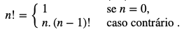
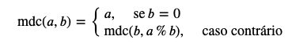
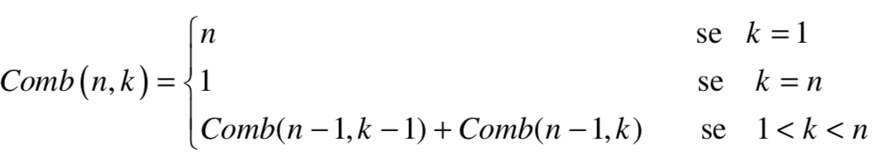
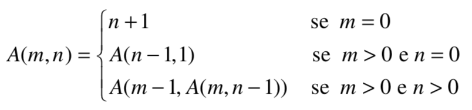

# Funções recursivas

## Introdução

Uma solução recursiva para um problema depende da combinação de soluções para instâncias mais pequenas desse mesmo problema. Esta é uma ideia central na computação e na engenharia, e pode ser aplicada a inúmeros problemas. Existe em particular metodologias para resolução de problemas que têm por base soluções recursivas, como dividir para conquistar e programação dinâmica.

Python, tal como a maioria das linguagens de programação, suporta explicitamente soluções recursivas permitindo que as funções possam invocar-se a si mesmas. E, como vimos na última aula, em programação funcional e em linguagens puramente funcionais, estamos limitados ao uso de funções recursivas, não sendo possível o uso de ciclos iterativos.

O poder da recursividade reside na possibilidade de definirmos conjuntos infinitos utilizando expressões finitas. A recursividade pode observar-se ao nível dos cálculos e/ou ao nível da estrutura.

## Números de Fibonacci

Na matemática também utilizamos frequentemente definições recursivas, vejamos o caso do factorial e dos [números de Fibonacci](https://en.wikipedia.org/wiki/Fibonacci_number): 



Podemos implementar a função `factorial` seguindo a definição recursiva ou iterativa, respectivamente, como se segue, 

```python
def factorial(n):
    if n == 0:
        return 1
    else:
        return n * factorial(n-1)

def factorial(n):
    res = 1
    for i in range(1,n+1):
        res = res * i
    return res
```

Notar que na implementação recursiva não existem ciclos explícitos, e que o factorial de `n` é obtido a partir do factorial de um número mais pequeno, neste caso factorial de `n-1`, i.e., um sub-problema mais pequeno. Para que o algoritmo termine é necessário um caso base, um valor para o qual saibamos o valor do factorial, i.e., um sub-problema base para qual saibamos a solução.

**Exercício:** Seguir o funcionamento das duas implementações da função `factorial` em [http://pythontutor.com/visualize.html](http://pythontutor.com/visualize.html).

## Máximo divisor comum

o algoritmo de Euclides é um método simples e eficiente de encontrar o máximo divisor comum entre dois números inteiros diferentes de zero. É um dos algoritmos mais antigos, conhecido desde que surgiu nos Livros VII e X da obra Elementos de Euclides por volta de 300 a.C.

O MDC de dois números inteiros é o maior número inteiro que divide ambos sem deixar [resto](https://pt.wikipedia.org/wiki/Resto). O algoritmo de Euclides é baseado no princípio de que o MDC não muda se o menor número for subtraído ao maior. Por exemplo, 21 é o MDC de 252 e 105 \(252 = 21 × 12; 105 = 21 × 5\); já que 252 − 105 = 147, o MDC de 147 e 105 é também 21. Como o maior dos dois números é reduzido, a repetição deste processo irá gerar sucessivamente números menores, até convergir em zero. Nesse momento, o MDC é o outro número inteiro, maior que zero. Definição matemática:



Implementação: 

```python
def mdc(m, n)
    if n == 0:
        return m
    else:
        return mdc(n, m%n)
```

## Recursão sobre listas

É possível explorar o uso da recursividade sob  listas para construir operações assentes em definições recursivas.

### Comprimento

Vamos  cálcular o comprimento de uma lista,  sem usar `len`.

```python
def compr(w):
    if w==[]:
        return 0
    else:
        return 1+compr(w[1:])
```

### Média

è possivel   implementar a função `media` que calcule o valor médio de uma lista de números. Para tal, definiremos uma função auxiliar, à custa da qual será muito simples calcular a média.

```python
def somalista(w):
    if w==[]:
        return 0
    else:
        return w[0]+somalista(w[1:])
        

def media(w):
    if w==[]:
        print("erro, lista vazia")
    else:
        return somalista(w)/len(w)
```

### Lista dos naturais até n

Implementemos agora uma função `ate` que devolva a lista dos números naturais até um valor dado `n` \(exclusive\), que permita obter o mesmo efeito de `list(range(n))`.

```python
def ate(n):
    if n==0:
        return []
    else: 
        return ate(n-1)+[n-1]
```

### Lista dos naturais até n

Implementemos agora uma função `ate` que devolva a lista dos números naturais até um valor dado `n` \(exclusive\), que permita obter o mesmo efeito de `list(range(n))`.

```python
def ate(n):
    if n==0:
        return []
    else: 
        return ate(n-1)+[n-1]
```

## Conclusão

Em resumo, quer as definições recursivas quer as funções recursivas assentam na existência de: 

* de um _caso base_ ou _caso terminal_, que corresponde à versão mais simples do problema \(na realidade, em alguns problemas, podem existir vários casos terminais\);
* de um _passo recursivo_ ou _caso geral_, que corresponde à definição recursiva de uma solução para o problema em termos de soluções para sub-problemas deste mas mais simples.

## Exercícios práticos

1. Uma _capicua_ é um número natural que se lê de igual modo da esquerda para a direita ou da direita para a esquerda. O conceito análogo, para palavras, é o de _palíndromo_.  Sugestão: começe  por definir a função `palindromoQ` que determina se uma lista de valores dada é ou não um palíndromo em seguida defina a  função auxiliar  digitos que extrai, dado um número natural, a lista dos seus dígitos. Torna-se simples, de seguida, definir a função `capicuaQ`.
2. Escreva uma função recursiva que escrever no monitor os números inteiros pares, no intervalo de 1 a 100.
3. Implemente uma função recursiva que, dados dois números inteiros x e n, calcula o valor de x elevado a n
4. Escreva uma função recursiva que calcule a soma dos dígitos decimais de um inteiro estritamente positivo n
5. Escreva uma função recursiva eficiente que receba inteiros estritamente positivos k e n e calcule kn.  \(Suponha que kn cabe em um [int](https://www.ime.usp.br/~pf/algoritmos/aulas/int.html#signed-int).\)  Quantas multiplicações sua função executa aproximadamente
6. Considere uma partida de futebol entre duas equipes A x B, cujo placar final é m x n, em que m e n são os números de gols marcados por A e B, respectivamente. Implemente um algoritmo recursivo que imprima todas as possíveis sucessões de gols marcados. Por exemplo, para um resultado de 3 x 1 as possíveis sucessões de gols são "A A A B”, "A A B A”, "A B A A" e "B A A A".
7. Escreva uma função recursiva que imprimir os n primeiros números naturais em ordem decrescente.
8. Implemente recursivamente uma função Min que retorne o menor valor armazenado em um tuplo  T, contendo n números inteiros.
9. Faça uma função recusiva que passado um  tuplo ordenado de tamanho n, verificar se um determinado elemento está ou não presente.
10. O superfatorial de um número N é definida pelo produto dos N primeiros fatoriais de N. Assim, o superfatorial de 4 é sf\(4\) = 1!  _2!_  3! \* 4! = 288 Faça uma função recursiva que receba um número inteiro positivo N e retorne o superfatorial desse número.
11. A multiplicação à Russa consiste em: a. Escrever os números A e B, que se deseja multiplicar na parte superior das colunas. b. Dividir A por 2, sucessivamente, ignorando o resto até chegar à unidade, escrever os resultados da coluna A. c. Multiplicar B por 2 tantas vezes quantas se haja dividido A por 2, escrever os resultados sucessivos na coluna B. d. Somar todos os números da coluna B que estejam ao lado de um número ímpar da coluna A. Escreva uma função recursiva que permita fazer à multiplicação a russa de 2 entradas;
12. Escreva, usando a linguagem python, uma função recursiva, SomaSerie\(i,j,k: inteiro\): inteiro, que devolva a soma da série de valores do intervalo \[i,j\], com incremento k.
13. Escreva uma função recursiva que inverta a ordem dos valores armazenados em um tuplo.
14. Considere a função Comb\(n, k\), que representa o número de grupos distintos com k pessoas que podem ser formados a partir de n pessoas. Por exemplo, Comb\(4, 3\) = 4, pois com 4 pessoas \(A, B, C, D\), é possível formar 4 diferentes grupos: ABC, ABD, ACD e BCD. Escreva uma função recursiva de Comb \(n,k\). tenha em conta a definição apresentada.



## Exercícios laboratoriais

1. Escreva uma função recursiva que devolva a soma dos elementos [positivos](https://www.ime.usp.br/~pf/algoritmos/aulas/footnotes/positivo-negativo.html) de uma lista de inteiros passada por parâmetro
2. Escreva uma função recursiva que devolva o _maior valor dos elementos de uma lista passada por parâmetro_
3. Escreva uma função recursiva que calcule o produto dos elementos estritamente positivos de uma lista  de inteiros 
4. Escreva uma função recursiva que imprimir os n primeiros números naturais em ordem crescente.
5. Escreva uma função recursiva que calcula o maior divisor comum dos inteiros estritamente positivos m e n.
6. O problema  conhecido como torre de Hanói foi publicado em 1883 pelo matemático francês Edouard Lucas. Consiste em transferir, com o menor número de movimentos, a torre composta por N discos do pino A \(origem\) para o pino C \(destino\), utilizando o pino B como auxiliar. Somente um disco pode ser movimentado de cada vez e um disco não pode ser colocado sobre outro disco de menor diâmetro. Faça um programa que utilize funções recursivas para resolver o problema. 
7. Implemente recursivamente uma função Max que retorne o maior valor armazenado em um tuplo  T, contendo n números inteiros.
8. Escreva uma função recursiva que verifica se um determinado valor está ou não presente em uma lista.
9. Escreva uma função recursiva que determine quantas vezes um dígito K ocorre em um número natural N. Por exemplo, o dígito 2 ocorre 3 vezes em 762021192.
10. Escreva uma função recursiva que gera recursivamente todas as representações de n bits, de tal modo que, entre duas sucessivas, haja um único bit distinto.
11. A sequência de Padovan é uma sequência de naturais P\(n\) definida pelos valores iniciais P\(0\) = P\(1\) = p\(2\) = 1 e a seguinte relação recursiva P\(n\) = P\(n - 2\) + P\(n - 3\) se n &gt; 2. Alguns valores da sequência são: 1, 1, 1, 2, 2, 3, 4, 5, 7, 9, 12, 16, 21, 28... Faça uma função recursiva que receba um número N e retorne o N-ésimo termo da sequência de Padovan.
12. Os números tetranacci iniciam com quatro termos pré-determinados e a partir daí todos os demais números são obtidos pela soma dos quatro números anteriores. Os primeiros números tetranacci são: 0, 0, 0, 1, 1, 2, 4, 8, 15, 29, 56, 108, 208... Faça uma função recursiva que receba um número N e retorne o N-ésimo termo da sequência de tetranacci.
13. Faça uma função que dado um número natural, imprimir recursivamente a sua representação binária.
14. Dada a definição da função de Ackerman, válida para valores inteiros não negativos de m e n, implemente uma versão recursiva da função.



