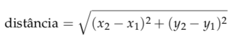
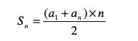
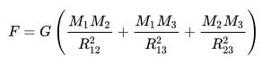

# Programas simples

## Introdução

Um programa em Ptyhon é em geral na sua forma mais simples uma sequência de comandos.  Mais em concreto um programa consiste numa sequência de  **instruções**, ou em notação **BNF**: 

```sql
<programa> ::= <sequência de instruções>
```

Os  tipos de controlo fundamentais na lingaugem **Python**, tal como na maior parte das outras linguagens,  são a **sequenciação**, a **selecção** e a **repetição**. A **sequenciação** é a estrutura de controlo mais simples e determina simplesmente que as instruções são executadas pela ordem em que aparecem no programa. 

Em Python, numa sequenciação de instruções, estas surgem linhas consecutivas. Assumindo que o símbolo terminal `return` denota a mudança de linha, temos em notação BNF: 

```sql
<sequência de instruções> ::= <instrução> RETURN | 
                              <instrução> RETURN <sequência de instruções>
```

Exemplo de um programa com uma sequência de instruções:

```sql
valor = float(input('Valor? '))
tanb = float(input('TANB (%)? '))
juros = valor*tanb/100
print('Juros:', juros)

#Exemplo utilização
Valor? 40000
TANB (%)? 0.5
Juros: 200.0
```


Num programa em **Python** as linhas vazias podem ser entendidas como instruções vazias, caso em que o interpretador não realiza qualquer acção e passa à próxima linha, i.e., a próxima instrução.



> Para visualizar ou analisar a execução de programas passo a passo podemos utilizar um debugger como o [pdb](https://docs.python.org/2/library/pdb.html), ou podemos utilizar ferramentas como [http://pythontutor.com/visualize.html](http://pythontutor.com/visualize.html).

  
Exercícios práticos


1. Crie um programa que lê o nome e duas notas de um aluno, e em seguida calcula a sua média.
2. Dados os comprimentos dos lados de um triângulo \(lado1 e lado2\), crie um programa para calcular a hipotenusa.
3. Crie um programa que lê a duração de uma tarefa em segundos e transforma para hora, minuto e segundo.
4. Crie um programa que leia um número inteiro e verifique se o número tem 4 algarismos.
5. Crie um programa que permite cambiar euros em dólares considerando a taxa de conversão 1,17
6. Crie um programa que permite realizar o cálculo da distância euclidiana entre dois pontos, sendo que cada ponto é definido pelas coordenadas \(x,y\).  
7. Faça um programa para ler: número da conta do cliente, saldo, débito e crédito. Após, calcular e escrever o saldo atual \(saldo atual = saldo - débito + crédito\).
8. Faça um programa para ler: quantidade atual em estoque, quantidade máxima em estoque e quantidade mínima em estoque de um produto. Calcular e escrever a quantidade média \(\(quantidade média = quantidade máxima + quantidade mínima\)/2\).
9. Faça um programa que imprima a média aritmética dos números 8,9 e 7. A média dos números 4, 5 e 6. A soma das duas médias e a média das médias.
10. Faça um Programa que imprima todas as vogais 
11. Faça um programa que leia dois números e mostre os seguintes resultados: a\)Dividendo: b\)Divisor: c\)Quociente: d\)Resto 
12. Faça um programa que leia 4 números e mostre a média ponderada, sabendo-se que os pesos são respectivamente: 1, 2, 3 e 4
13. Faça um programa que calcule o valor de uma prestação em atraso, utilizando a fórmula: PRESTAÇÃO = VALOR + \(VALOR  _\(TAXA/100\)_  TEMPO\)
14. Considere que o número de uma placa de veículo é composto por quatro algarismos. Construa um programa que leia este número e apresente o algarismo correspondente à casa das unidades, dezenas e centenas.
15. Seja uma sequência A,B,C, ... determinando um Progressão Aritmética \(P.A.\), o termo médio \(B\) de uma P.A. é determinado pela média aritmética de seus termos, sucessor \(C\) e antecessor \(A\). Com base neste enunciado construa um programa que calcule o termo médio \(B\) através da seguinte formula  B = \(A+C\) /2
16. Criar umprograma que leia o numerador e o denominador de uma fração e transforme esses valores em um número racional.
17. Seja uma sequência A,B,C, ... determinando um Progressão Geométrica \(P.G.\), o termo médio \(B\) de uma P.G. é determinado pela média geométrica de seus termos, sucessor \(C\) e antecessor \(B\). Com base neste enunciado construa um programa que calcule o termo médio \(B\) através da seguinte formula  B\*B =  A \* C 
18. Criar um programa que leia dois valores para as variáveis A e B, que efetue a troca dos valores de forma que a variável A passe a ter o valor da variável B e que a variável B passe a ter o valor da variável A. Apresente os valores trocados.
19. Escreva um programa  que leia um número inteiro e imprima o seu sucessor e seu antecessor.
20. Certo dia o professor de Johann Friederich Carl Gauss \(aos 10 anos de idade\) mandou que os alunos somassem os números de 1 a 100. Imediatamente Gauss achou a resposta – 5050 – aparentemente sem cálculos. Supõe-se que já aí, Gauss, houvesse descoberto a fórmula de uma soma de uma progressão aritmética e faça um programa que implemente a formula.




## Exercícios laboratoriais

1. Desenvolva um programa   que leia um número inteiro e imprima o seu antecessor e seu sucessor.
2. Escreva um programa para calcular um valor dum polinómio do 2° grau dados a, b, c e o valor de x.
3. Escreva um programa que, a partir do preço em euros e do dinheiro entregue, apresente o troco usando o menor número possível de moedas.
4. Ler um número inteiro e escrever o seu antecessor e o seu sucessor.
5. Faça um Programa que peça três números e imprima a soma. 
6. Escreva um programa que leia dois números reais e imprima a média aritmética entre esses dois valores com a seguinte mensagem “MÉDIA” antes do resultado.
7. Faça um Programa que peça as 7 notas  e mostre a média. 
8. Faça um Programa que converta centímetros para metros
9. Faça um Programa que peça o raio de um círculo, calcule e mostre sua área. 
10. Faça um Programa que calcule a área de um quadrado. 
11. Faça um Programa que pergunte quanto você ganha por hora e o número de horas trabalhadas no mês. Calcule e mostre o total do seu salário no referido mês. 
12. Faça um Programa que peça a temperatura em graus Farenheit, transforme e mostre a temperatura em graus Celsius.
13. Escreva um programa  que leia um número real e imprima a terça parte deste número.
14. Escreva um programa  que leia dois números inteiros e imprima o resultado da soma destes dois valores. Antes do resultado, deve ser impressa a seguinte mensagem “SOMA”.
15. Tendo como dado de entrada a altura \(h\) de uma mulher, construa um programa que calcule seu peso ideal, utilizando as seguinte fórmula: \(62.1\*h\) - 44.7
16. Criar um programa  que leia um valor de hora \(hora:minutos\) e informe \(calcule\) o total de segundos se passaram desde o início do dia \(0:00:00s\).
17. Programa máquina de Café. Considere as seguintes condições: -só aceita moedas de 5, 10, 20, 50, 100 e 200 Cêntimos; -inicialmente para trocos existem na máquina 100 moedas de 5, 10, 20, 50, 100 Cêntimos e zero moedas de 200 Cêntimos; -só permite seleccionar um tipo de café \(C ou c\)  custo 40 Cêntimos; -devolve o menor número de moedas quando existe troco; -regista os cafés e o dinheiro realizado, actualizando em cada pedido os contadores de moedas existente na máquina.
18. Criar um programa  que efetue o cálculo da quantidade de litros de combustível gastos em uma viagem, sabendo-se que o carro faz 12 km com um litro. Deverão ser fornecidos o tempo gasto na viagem e a velocidade média.  Tenha em atenção que Distância = Tempo x Velocidade e  Litros = Distancia / 12.
19. Para vários ações, a base de cálculo é o salário base. Fazer um programa que leia o valor do salário base e o valor do salário de uma pessoa. Calcular e imprimir quantos salários base essa pessoa ganha.
20. Três massas m1, m2, m3 estão separadas por distâncias r12, r13 e r23, como mostra a figura:



Crie um programa para ler um programa para ler os valores de m1, m2, m3, r12, r13, r23; calcular e imprimir a força de coesão. Para massa em quilogramas e distância em metros, G = 6,67 × 10−11 N·m2/kg2. Assumir que todos os valores são reais.

  


