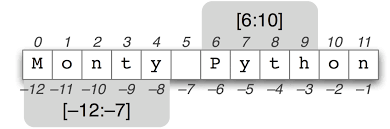

# Tuplos e ciclos contados

## Tuplos

Um tuplo é uma sequência de elementos e correspondem à noção de **vector e** e os seus elementos, tal como nos vectores,  são referenciados  através do seu **índice** ou **posição.**



Temos a seguinte sintaxe em BNF: 

```sql
<tuplo> ::= () | (<elemento>, <elementos>)

<elementos> ::= <nada> | <elemento> | <elemento>, <elementos>

<elemento> ::= <expressão> | <tuplo> | <lista> | <dicionário>

<nada> ::=
```

### Declarar  um tuplo

Sintaticamente, um tuplo é um **`vetor`** de valores separados por vírgulas qual associados a uma variável, através de da instrução de atribuição. A seguinte interacção apresenta a declaração de um **`tuplo`** constituído por  **12 caracteres:**

```sql
palavra =('M', 'o', 'n', 't', 'y','','P', 'y','h','t','o','n')
palavra

('M', 'o', 'n', 't', 'y', '', 'P', 'y', 'h', 't', 'o', 'n'
```

### Aceder a um elemento de um tuplo

Depois da criação de um **`tuplo`**, podemos referir-nos a qualquer dos seus elementos especificando o nome do **`tuplo`** e a posição  que o elemento desejado ocupa dentro deste. A referência a um elemento de um **`tuplo`** corresponde a um **nome indexado**. 

Os índices começam no número zero \(correspondente ao primeiro elemento do **`tuplo`**\), aumentando  até ao número de elementos do tuplo menos um; em alternativa, o índice -1 corresponde ao último elemento do tuplo, o índice -2 corresponde ao penúltimo elemento do **`tuplo`** e assim sucessivamente. A seguinte interacção apresenta o acesso a um elemento de um **`tuplo`**:

```sql
palavra =('M', 'o', 'n', 't', 'y','','P', 'y','h','t','o','n')

Uso de indice positivo (0, 1, ..., 11)
palavra[0]
'M'

palavra[1]
'o'
palavra[11]
'n'

#Uso de indice negativo (-1, -2, ..., 12)
palavra[-1]
'n'
palavra[-5]
'y'
palavra[-12]
'M'

```

### Aceder a um sub-conjunto de um tuplo  

```sql
palavra =('M', 'o', 'n', 't', 'y','','P', 'y','h','t','o','n')

palavra[0:11]
('M', 'o', 'n', 't', 'y','','P', 'y','h','t','o')

palavra[0:12]
('M', 'o', 'n', 't', 'y','','P', 'y','h','t','o','n')

palavra[3:10]
('t', 'y', '', 'P', 'y', 'h', 't')
```

### Alterar um elemento de um tuplo

 um **`tuplo`** é um tipo **imutável**. Isto significa que uma vez que um tuplo é criado, ela não pode ser alterado. A seguinte interacção apresenta a tentativa de alterar um  **`tuplo`** em que resulta num erro, porque como foi referido um **`tuplo`** não pode ser modificado, uma vez criado:

```sql
palavra =('M', 'o', 'n', 't', 'y','','P', 'y','h','t','o','n')
palavra[2] ='f'

TypeError: ’tuple’ object does not support item assignment
```

### Operações sobre tuplos

A seguinte interacção mostra a utilização de algumas operações, adicionais, sobre **`tuplos`**:

| **Expressão** | **Resultado** | **Descrição** |
| :--- | :--- | :--- |
| len\(\(1, 2, 3\)\) | **3** | número de elementos |
| \(1, 2, 3\) + \(4, 5, 6\) | **\(1, 2, 3, 4, 5, 6\)** | concatenação |
| \('Hi!',\) \* 4 | **\('Hi!', 'Hi!', 'Hi!', 'Hi!'\)** | Repetição |
| 3 in \(1, 2, 3\) | **True** | Pertença a um tuplo |

Observer a seguinte interacção onde criamos dois  tuplos \(a e b\) e depois fazemos a sua soma.

```python
a = (3, 4, 5, 6)

b = (7, 8)

a = a + b
>>>a
>>>(3, 4, 5, 6, 7, 8)
```

Podemos ser levados s pensar que no  comando que fornecemos ao Python, a = a + b, alteramos o tuplo a, o que pode parecer uma violação ao facto de os tuplos serem entidades imutáveis. O que na realidade aconteceu, foi que modificamos o valor da variável a que estava associada a um tuplo, sendo esta uma operação valida. Quando afirmamos que os tuplos são imutáveis, querıamos dizer que não podemos alterar um valor de um elemento de um tuplo, podendo perfeitamente criar tuplos a partir de outros tuplos, como a interacção anterior o mostra.

## Ciclos contados

Em Python, um ciclo contado é realizado através da utilização da instrução **`for`**, a qual permite especificar a execução repetitiva de uma instrução composta para uma sequência de valores de uma variável de controle.

Em geral, num ciclo contado especificamos o valor inicial da variável de controlo, a forma de actualizar a mesma, e a condição de paragem. Logo, um ciclo contado permite iterar sobre uma sequência de valores.

Em Python utilizamos a instrução `for` para definir ciclos contados e temos a seguinte sintaxe \(em BNF\): 

```sql
<instrução for> ::= for <nome> in <expressão>: NEWLINE <bloco de instruções>
```

Neste caso o `<nome>` corresponde à variável de controlo e o valor `<expressão>` tem de ser uma sequência, e.g., um **tuplo**. 

 Existem várias entidades em **Python** que podem ser vistas como sequências, também designadas de **iteráveis**. 

O comportamento da instrução **`for`** consiste em executar o corpo do ciclo para cada elemento na sequência resultante de avaliar a **`<expressão>`**. Tal como na instrução **`while`**, na instrução **`for`** podemos utilizar a instrução **`break`** no corpo do ciclo \(ou bloco de instruções\) para interromper o mesmo independentemente do valor da variável de controlo.

Vejamos o seguinte  exemplo de interacção onde criamos a função soma que devolve a soma dos elementos de um tuplo. 

```python
def soma(t):
    resultado = 0
    
    for x in t:
        resultado = resultado + x
    
    return resultado

soma((1,2,3,4,5))
```

## Função pré-definida range

Para gerar sequências em Python podemos utilizar a função pré-definida `range` que permite gerar uma sequencia de elementos. A função range é definidade através da seuinte notação BNF:

```sql
range(<argumentos>)

<argumentos> ::= <expressão> | <expressão>, <expressão> | 
                 <expressão, <expressão>, <expressão>
```

Em que os valores de cada &lt;expressão&gt; são do tipo inteiro e o resultado é uma sequência. O primeiro argumento define o início da sequência \(inclusive\), o segundo argumento define o fim da sequência \(exclusive\), e terceiro argumento define o passo ou incremento.

Exemplos de utilização da função range:

```python
>>> tuple(range(10))
(0, 1, 2, 3, 4, 5, 6, 7, 8, 9)
```

Corresponde ao formato range\(e1\). Devolve uma sequencia contendo os inteiros entre 0 e **10 − 1**, i.e., 9.

```python
>>> tuple(range(5,10))
(5, 6, 7, 8, 9)
```

Devolve uma sequencia contendo os inteiros entre 5 e **10 − 1**, i.e., 9.

```python
>>> tuple(range(-5,10))
(-5, -4, -3, -2, -1, 0, 1, 2, 3, 4, 5, 6, 7, 8, 9)
```

Corresponde ao formato range\(e1, e2\). Devolve a sequencia contendo os inteiros que comecam em e1  \(-5\)  até e2−1 \(9\)

```python
>>> tuple(range(-5,10,2))
(-5, -3, -1, 1, 3, 5, 7, 9))

>>> tuple(range(10,-5,-2))
(10, 8, 6, 4, 2, 0, -2, -4)

>>> tuple(range(10,-5,-1))
(10, 9, 8, 7, 6, 5, 4, 3, 2, 1, 0, -1, -2, -3, -4)
```

Corresponde ao formato range\(e1, e2, e3\). Devolve a sequencia contendo os inteiros que comecam em e1  \(-5\) e nunca sendo superiores a e2−1, em que cada elemento da sequencia é obtido do anterior somando e3.  

Recorrendo à funcao range podemos escrever a seguinte funcao alternativa para calcular a soma dos elementos de um tuplo:

```python
def soma_elementos (t):
    soma = 0
    for i in range(len(t)):
        soma = soma + t[i]
return soma

```

## Exercícios práticos

1. Faça uma função que, dado um número inteiro positivo n, calcule a soma dos n primeiros números inteiros positivos;
2. Dado um número inteiro positivo n, imprimir os n primeiros naturais ímpares.
3. Um número n diz-se triangular se n = 1 + 2 + ··· + k para algum natural k. Os primeiros cinco números triangulares são 1, 3, 6, 10 e 15. Escreva uma função triangular\(n\) cujo resultado é True ou False conforme n é triangular ou não. Sugestão: efetue um ciclo que calcule 1 + 2 + · · · + k para valores sucessivos de k enquanto a soma não ultrapasse n \(veja o exemplo apresentado no 󿰇nal da aula téórica 5\);
4. O método de Newton pode ser usado para aproximar o valor da raiz quadrada de um número positivo q. Para primeira aproximação tomamos X0 = q/2; para as aproximações seguintes usamos a recorrência: Xn+1 = 1/2 \* \(Xn + q/Xn\). Defina uma função aprox\(q, n\) que calcula o valor aproximado da raiz usando n iterações deste método \(isto é, calculando Xn segundo a recorrência acima\).
5. Crie um programa que calcule o Máximo Divisor Comum entre dois números inteiros positivos.  O máximo divisor comum \(abreviadamente, MDC\) entre dois ou mais [números inteiros](https://pt.wikipedia.org/wiki/N%C3%BAmeros_inteiros) é o maior número inteiro que é [fator](https://pt.wikipedia.org/wiki/Factoriza%C3%A7%C3%A3o) de tais números. Por exemplo, os divisores comuns de 12 e 18 são 1,2,3 e 6. Logo o MDC \(12,18\) = 6;
6. Dizemos que um inteiro positivo n é perfeito se for igual à soma de seus divisores positivos diferentes de n. Exemplo: 6 é perfeito, pois 1+2+3 = 6. Faça um programa que Dado um inteiro positivo n, verificar se n é perfeito. 
7. Na matemática, a Sucessão de Fibonacci \(também Sequência de Fibonacci\), é uma sequência de números inteiros, começando normalmente por 0 e 1, na qual, cada termo subsequente corresponde à soma dos dois anteriores. Faça um programa que calcule os n primeiros termos da série. Exemplo: 0,1, 1, 2, 3, 5, 8, 13, 21, 34, 55, 89, 144, 233, 377, 610;
8. Crie um programa que calcule o fatorial de um número inteiro n. O fatorial de um número natural n, representado por n!, é o produto de todos os inteiros positivos menores ou iguais a n.
9. Escreva um programa que procure e indique o maior valor \(e a respetiva posição\) de um tuplo de 10 valores.  ****
10. Escreva um programa que leia 20 valores inteiros entre 1 e 10 e insira-os num tuplo. Depois, o utilizador deverá indicar um valor e o programa deverá indicar em que posição ou posições onde se encontra esse mesmo valor. Se o valor não existir no vetor o programa deverá dar a respetiva mensagem.
11. Crie um programa que apresente a soma de todos os valores de um tuplo de inteiros de 10 posições. 
12. Escreva um programa que determine o 2º maior valor de um tuplo.
13. Crie um programa que leia um conjunto de valores inteiros do utilizador e os coloque num tuplo. O programa deverá terminar a leitura quando for introduzido um número que já exista no tuplo, ou seja, quando for introduzido um número repetido. No final deverá apresentar o tuplo.
14. Crie um programa que leia 10 números reais, coloque-os num tuplo e calcule a sua média.
15. Escreva um programa que preencha um tuplo de 20 posições com os primeiros 20 números primos.
16. Escreva um programa que indique se todos os valores de um tuplo são iguais, se são todos diferentes, ou se há valores repetidos no tuplo.
17. Crie um programa que leia um tuplo de inteiros cujo tamanho será introduzido pelo utilizador, tamanho esse que nunca será inferior a 5 ou superior a 25.O programa deverá indicar ao utilizador se o tuplo é constituído \(ou não\) por valores pares e ímpares alternados. Exemplo: O vetor \[1,2,5,6,3,2\] verifica esta condição.
18. Crie um programa que ordene um vetor de 10 elementos por ordem crescente e decrescente.
19. Escreva um programa que procure e indique o maior valor \(e a respectiva posição\) de um vector de 10 posições introduzido pelo utilizador.

## Exercícios laboratoriais

1. Escreva uma função  maior\(t \) que recebe um tuplo t de números do tipo float e escreve o maior deles. Esta função tem um segundo argumento que é o número de elementos do vector. Resolva agora o exercício anterior com base nesta função.
2. Escreva uma função que recebe um tuplo de números do tipo int e escreve no ecrã a soma do número menor com o número maior.
3. Escreva uma função que recebe um tuplo t de números do tipo int e que devolda um tuplo que inverta a ordem pela qual estão guardados no tuplo. 
4. Escreva um método que recebe um número inteiro como argumento e verifica se esse mesmo número é um palíndromo \(capicua\) inverso ou não. O resultado do método é um valor booleano: true ou false. Um número é um palíndromo inverso se lido de “pernas para o ar” e da direita para a esquerda for igual ao original, ou seja: 1881 é um palíndromo inversos 232 não é.
5. Escreva uma função que receba um tuplo t de inteiros e que devolva o calculo do valor médio dos valores guardados no tuplo. 
6. Escreva uma função  que calcule os todos os número primos até n, sendo n recebido por parâmetro. utilize o Crivo de Erastotenes
7. Escreva uma função  primeira\(c,txt\) que procure se um caracter c ocorre em na cadeia txt. Em caso afirmativo, retorne o índice da primeira ocorrência, em caso negativo, retorne -1.
8. Um número d é divisor de n \(ou equivalente, n é múltiplo de d\) se e só se o resto da divisão de n por d for zero. Escreva uma função divs\(n\) que calcula o tuplo  dos divisores de n por ordem crescente. Exemplo: divs\(12\) . devolve \(1, 2, 3, 4, 6, 12 \)
9. Escreva uma função dif\(A,B\) para construir a diferença A  B = { a ∈ A : a ∈/ B } de dois conjuntos A e B representados como tuplos. Pode assumir que cada tuplo não tem elementos repetidos. A ordem dos elementos no resultado não é importante. Por exemplo:  dif\(\[2, 3, 5\], \[1, 2, 3\]\) . resulta \[5\].
10. Utilizando tuplos, pretende-se implementar uma função converte\(n,b\) que converte o inteiro n para a base b, ficando o resultado na lista que é retornada. Exempo:  converte\(14,2\) -&gt; \[1,1,1,0\]  \(pois 14 = 8+4+2\)  converte\(47,16\) -&gt; \[2,15\] \(pois 47 = 2\*16 + 15\)
11. Escreva um programa que verifique se todos os elementos de um determinado vetor existem noutro vetor.
12. Escreva um programa que inverta a ordem dos elementos de um vetor de inteiros.
13. Crie um programa que conte o número de números primos num vetor de inteiros.
14. Escreva um programa que peça as idades de 32 alunos de uma turma. O programa deve guardar estes valores num vetor e no final indicar a idade máxima, mínima média e moda da turma.
15. Crie um programa para somar 2 vetores de tamanhos diferentes e colocar o resultado num 3º vetor.
16. Crie um programa para determinar o maior valor entre as posições de dois vetores e colocar o resultado num 3º vetor.
17. Escreva um programa que leia as notas de um determinado número alunos a um conjunto de disciplinas. O número de alunos e o número de disciplinas são introduzidos pelo utilizador. Os valores das notas deverão estar entre 0 e 20 e guardados numa matriz. Depois deverá indicar a média de cada aluno, a nota mais alta, a nota mais baixa, a média de cada disciplina e o número de alunos com média superior a 9,5.
18. Crie um programa que simule 100 lançamentos de 2 dados, guarde os resultados em vetores e produza uma estatística.
19. Escreva um programa para determinar o valor mais comum \(moda\) num vetor de inteiros. Teste com um vetor de 100 posições preenchido aleatoriamente com valores entre 0 e 10.

